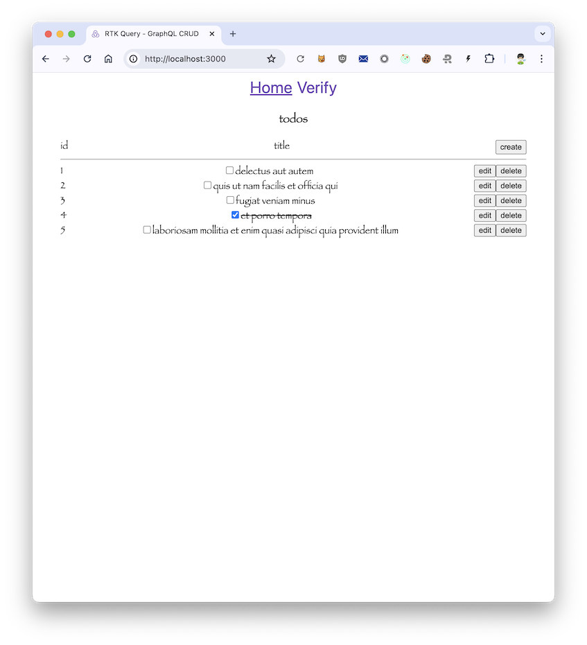

# rtk-query-graphql-crud

A "play-by-ear" exploration on RTK Query for wiring GraphQL-powered CRUD-operation.

### Why?

Ever since [the emergence of RTK Query in April 2021](https://github.com/reduxjs/redux-toolkit/releases/tag/v1.6.0-alpha.1), I haven't got a chance to tinker with it. So this is my sweet disposition three-odd years later.

This project is based on [Create Next App with Redux](https://github.com/vercel/next.js/tree/canary/examples/with-redux) template, using [GraphQL-flavoured](https://redux-toolkit.js.org/rtk-query/usage/customizing-queries#graphql-basequery) `baseQuery`, and hitting [GraphQLZero](https://graphqlzero.almansi.me/) API by Almansi.

CSS and TS-typings are kept to minimum in order to focus more on logic and functionality than on cosmetic and design purity.



## Spinning up the development server

```bash
pnpm dev
```

You can find other runnable scripts in [package.json](package.json).

## Author

Glenn Dwiyatcita ([@dwiyatci](https://tiny.cc/dwiyatci))

## License

WTFPL – Do What the Fuck You Want to Public License.

See [LICENSE.txt](LICENSE.txt).


